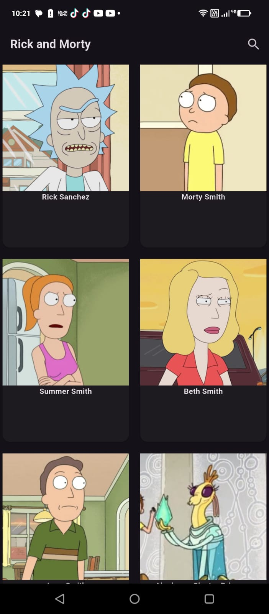
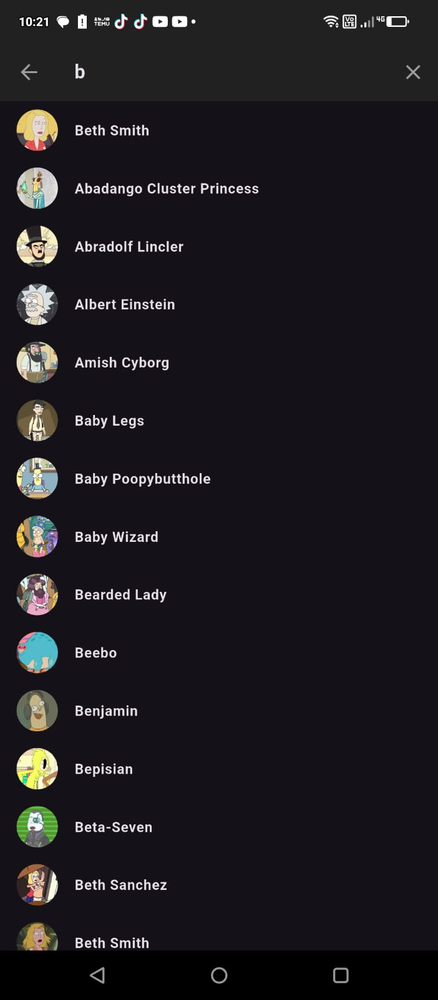
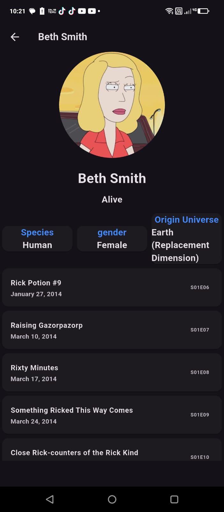

# rickmorty

Proyecto para consumir la API pública de Rick and Morty ([https://rickandmortyapi.com](https://rickandmortyapi.com)) y mostrar información de personajes, episodios y ubicaciones en flutter.

## TECNOLOGIAS


# VISUALIZACION

## VISTA PRINCIPAL



## VISTA BUSQUEDA



## VISTA PERSONAJE CON LOS CAPITULOS DONDE APARECE



### Instalación

```bash
git clone https://github.com/tuusuario/rickmorty.git
cd rickmorty
flutter pub get
flutter run
```

## Dependencias

#### cupertino_icons: ^1.0.8

#### http: ^1.3.0

#### provider: ^6.1.4

#### go_router: ^15.1.1

## Requisitos previos

# Getting Started

Sigue estos pasos para iniciar el proyecto:

# Prerrequisitos

--> Dart / Flutter

# Instalación

1. Clona el repositorio:

```bash
git clone https://github.com/tuusuario/rickmorty.git
cd rickmorty
```
